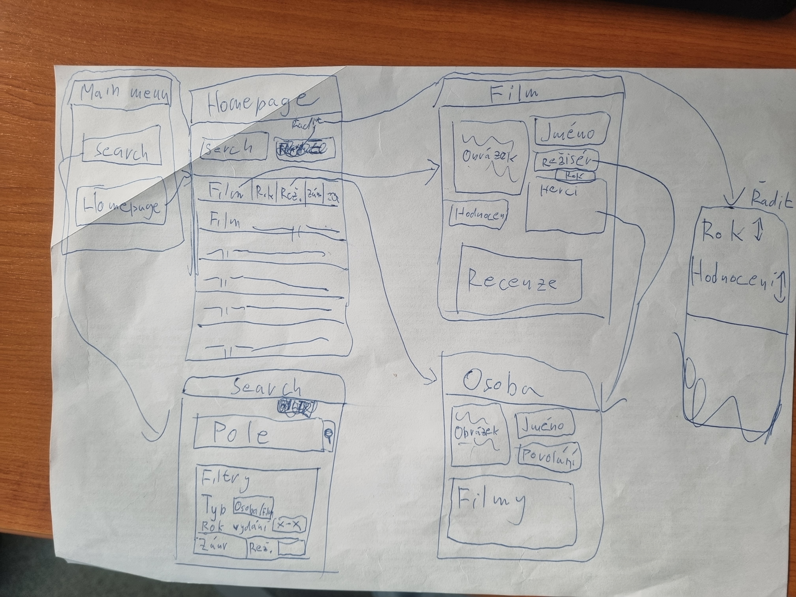

# Otakarova filmová databáze OFD

*Autor: Otakar Genzer <otakar.genzer.s@gyarab.cz>*

## Odborný článek

V administraci se spravuje databáze filmů, každý film má název, recenze ze kterých vyplívá celkové hodnocení a ranking, stručný popis, žánry a obrázek (plakát). Každý film má alespoň jednoho režiséra a několik herců.

Na homepage je seznam filmů, který je možné filtrovat (dle žánru) a řadit (dle hodnocení, roku, nebo abecedně). Seznam filmů tvoří řádky s názvem, rokem premiéry, režisérem, žánry a zmenšeninou titulního obrázku (plakátu). Kliknutím na název filmu se zobrazí stránka detailu filmu, kde se zobrazují všechny atributy filmu. Kliknutím na ostatní atributy se zobrazí příslušné stránky atribut. To znamená rok premiéry vás přesune do vyhledávání s filtrem rozkliknutého roku, žánr rozkliknutého žánru a režisér na svojí vlastní stránku. Z detailu filmu je možné ještě navíc prokliknutí na stránku herce. Stránka osoby zobrazuje Jméno, rok narození, fotografii a popis, dále jsou vylistované filmy, které daná osoba režírovala a ve kterých filmech hrála, přes ty je možné přejít do detailu filmu.

Hlavní menu obsahuje odkaz na homepage (seznam filmů) a odkaz na seznam osobností (osob). Dále se na všech stránkách nachází kolonka vyhledávání, v ní lze vyhledávat cokoliv, ale po rozkliknutí tlačítka pro filtrování v ní lze filtrovat podle typu (osoba/film), roku vydání, režiséra, herců a žánru.

## Wireframes

## Wireframes

